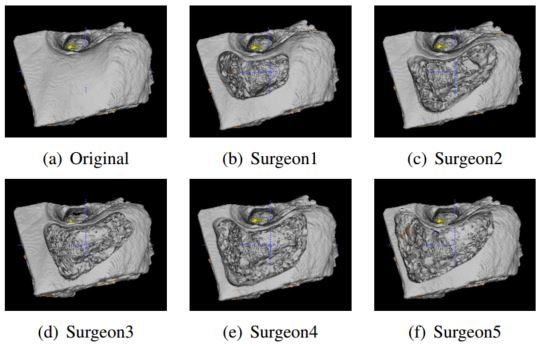

# Reward-penalty-Dice-loss

The paper of this project, named ***Learning Non-Unique Segmentation with Reward-Penalty Dice Loss***, was accepted by WCCI (IJCNN) 2020. Most research and applications of semantic segmentation focus on addressing unique segmentation problems, where there is only one gold standard segmentation result for every input image. This may not be true in some problems, e.g., medical applications. We may have non-unique segmentation annotations as different surgeons may perform successful surgeries for the same patient in slightly different
ways. To comprehensively learn non-unique segmentation tasks, we propose the reward-penalty Dice loss (RPDL) function as the optimization objective for deep convolutional neural networks (DCNN). RPDL is capable of helping DCNN learn non-unique segmentation by enhancing common regions and penalizing outside ones.

## Prerequisites
Python 3.6, Tensorflow 1.14.0, Keras 2.2.4

## Baselines
* Weighted cross-entropy loss (WCEL)
* Dice loss (DL)

## Published dataset
* Cortical mastoidectomy (CM) dataset in folder [cm_data](cm_data)

## Implement
Here is an example of 3D U-net. All loss functions can be found in [model3d](model3d)/[metrics.py](metrics.py). We implement our experiments on Keras and train models on NVIDIA V100 GPUs. There are two sets of experiments done on the cortical mastoidectomy (CM)
dataset in this paper. U-net with either WCEL or DL can be trained in [train_dice_wce.py](train_dice_wce.py). U-net with RPDL can be trained in [train_rpdice.py](train_rpdice.py).

**In Experiment 1**, we pick each bone out along with 7 surgeries performed on it by different surgeons as the testing set, which is the 9-fold cross validation for every model. The goal is to generate the surgical regions for new patients in the
first experiment. It is very challenging for DCNN to generate comparable surgical regions to those provided by surgeons for new patients because there are only 9 bones in the CM dataset in total, which are very different from each other. However, it is also a new benchmark with much potential for DCNN and we believe that DCNN will be able to provide surgical results competitive with those provided by surgeons, given a large size of the dataset in near future. 

**In Experiment 2**, we pick each surgeon out along with 9 surgeries performed on each bone. There are only 6 segmentation annotation images used for training in the second experiment, which is to evaluate if DCNN models can provide outputs more similar to segmentation annotation images than surgeons in the testing set. The second experiment is designed to compare all outputs provided by DCNN using different loss functions with surgeons in the testing set, which
is not as challenging as the first experiment.

## Pre-trained models
Pre-trained U-net models are in [model_bone](model_bone) of Experiment 1 and [model_surgeon](model_surgeon) of Experiment 2.

## Notes

When we train our models with different loss functions, we should either implement them in Experiment 1 or 2, with details in our paper. In experiment 1, different bones are picked out for testing. In experiment 2, different surgeons are picked out for testing.  

## License
This project is licensed under the MIT License - see the [LICENSE](LICENSE) file for details.
